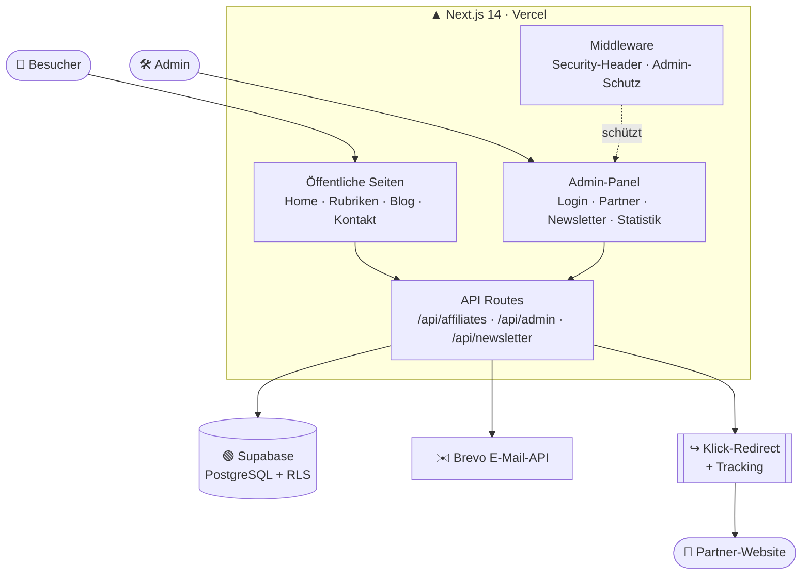

<div align="center">

# 🏡 Lobbium — Smart Family Life

**Clever sparen, den Alltag organisieren und Kinder spielerisch fördern — kompakt, modern & täglich aktualisiert.**

Eine moderne Affiliate‑Content‑Plattform: kuratierte Partner‑Empfehlungen mit täglicher Rotation, mehrsprachig angelegt, inklusive gehärtetem Admin‑Dashboard, Newsletter und Klick‑Tracking.

[](https://github.com/caseleasc-lobbium/lobbiumsmartfamilylife/actions/workflows/ci.yml)
[](https://nextjs.org)
[](https://react.dev)
[](https://supabase.com)
[](https://vercel.com)
[](https://www.lobbium.com)

</div>

---

## ✨ Überblick

Lobbium ist eine **Server‑gerenderte Affiliate‑Website** rund um Familienthemen. Besucher sehen täglich rotierende Partner‑Empfehlungen in vier Rubriken; ein geschütztes Admin‑Panel verwaltet Partner, Kategorien, Newsletter und Statistiken. Jeder Klick auf einen Partner wird serverseitig getrackt und über eine sichere Redirect‑Route weitergeleitet.

| | |
|---|---|
| **Typ** | Affiliate‑ / Content‑Plattform (kein SaaS) |
| **Rubriken** | Finanzen & Spartipps · Familienleben · Kinder & Bildung · Lifestyle |
| **Sprachen (angelegt)** | 🇩🇪 DE · 🇬🇧 EN · 🇫🇷 FR |
| **Hosting** | Vercel (Production: [www.lobbium.com](https://www.lobbium.com)) |

## 🧱 Tech‑Stack

- **Framework:** Next.js 14 (App Router, React Server/Client Components)
- **UI:** React 18 + Tailwind CSS
- **Datenbank:** Supabase (PostgreSQL) mit **Row‑Level‑Security**
- **E‑Mail:** Brevo (Transactional API)
- **Charts:** Chart.js + react‑chartjs‑2 (Admin‑Statistik)
- **Auth:** Passwort‑Login mit **scrypt‑Hash** + httpOnly‑Cookie, serverseitig via Middleware geschützt

## 🗺️ Architektur



**Datenfluss in Kürze:** Der Browser lädt Seiten von Next.js. Alle Datenzugriffe laufen ausschließlich **serverseitig** über API‑Routes mit dem Supabase **Service‑Role‑Key** (umgeht RLS kontrolliert). Der öffentliche `anon`‑Key hat durch RLS nur Lesezugriff auf die Content‑Tabellen — sensible Tabellen (Nutzer, Newsletter, Umsätze) sind gesperrt.

## 📁 Projektstruktur

```
app/
├─ page.jsx, HomeClient.jsx        # Startseite mit Partner-Grid + Filter
├─ finanzen-spartipps/ …           # 4 Rubrik-Seiten (je eigene page.jsx)
├─ blog/ kontakt/ impressum/ …     # Inhalts- & Rechtsseiten
├─ admin/                          # Geschütztes Dashboard
│  ├─ login/                       # Passwort-Login
│  ├─ affiliates/                  # Partner-CRUD (Liste, neu, bearbeiten, Statistik)
│  ├─ newsletter/ settings/ …      # weitere Admin-Bereiche
│  └─ layout.jsx                   # Sidebar + Client-Guard
└─ api/
   ├─ affiliates/                  # GET (öffentlich) · POST/PUT/DELETE (Admin-Cookie)
   │  └─ [id]/                     # Klick-Redirect + Tracking · PUT (bearbeiten)
   ├─ admin/                       # login · logout · stats
   └─ newsletter/ contact/ …       # Formular-Endpunkte

components/     # Sidebar, ChartCard, SectionHero, SiteFooter …
lib/            # supabase.js · security.js · password.js · email.js
middleware.js   # Security-Header + Admin-Routenschutz
locales/        # de.json · en.json · fr.json
```

## 🔐 Sicherheit

- **Passwörter** werden als **scrypt‑Hash** gespeichert (`ADMIN_PASSWORD_HASH`), nie im Klartext — Vergleich timing‑sicher via `crypto.timingSafeEqual`.
- **Admin‑Schreibzugriffe** (Partner/Kategorien anlegen, ändern, löschen) erfordern den httpOnly‑Cookie `lobbium_admin_auth`; geprüft server‑ und middleware‑seitig.
- **Row‑Level‑Security** ist auf allen Tabellen aktiv. Öffentlich lesbar sind nur `affiliates` und `affiliate_categories`; alles andere ist auf die Service‑Role beschränkt.
- **Middleware** setzt CSP‑, `X‑Frame‑Options`‑, `X‑Content‑Type‑Options`‑ und weitere Security‑Header auf jede Antwort.
- **Rate‑Limiting** auf Login‑ und Formular‑Endpunkten.

## 🚀 Lokales Setup

```bash
# 1) Abhängigkeiten installieren
npm install

# 2) .env.local anlegen (Werte siehe unten)

# 3) Dev-Server starten
npm run dev            # http://localhost:3000
```

### Benötigte Umgebungsvariablen

| Variable | Zweck |
|---|---|
| `NEXT_PUBLIC_SUPABASE_URL` | Supabase-Projekt-URL |
| `SUPABASE_SERVICE_ROLE_KEY` | Serverseitiger DB-Zugriff (geheim!) |
| `NEXT_PUBLIC_SUPABASE_ANON_KEY` | Öffentlicher Client-Key |
| `ADMIN_PASSWORD_HASH` | scrypt-Hash des Admin-Passworts (`scrypt:salt:hash`) |
| `ADMIN_EMAIL` | Zugelassene Admin-Adresse |
| `BREVO_API_KEY` | E-Mail-Versand (Newsletter, Kontakt) |
| `NEXT_PUBLIC_SITE_URL` | Basis-URL (z. B. `https://www.lobbium.com`) |
| `ENCRYPTION_KEY` | Verschlüsselung gespeicherter E-Mail-Adressen |

> 💡 Einen neuen Passwort‑Hash erzeugen:
> ```bash
> node --input-type=module -e 'import {hashPassword} from "./lib/password.js"; console.log(hashPassword("DEIN-PASSWORT"))'
> ```

## 📦 Build & Deployment

```bash
npm run build          # Production-Build (Output: standalone)
npm start              # Production-Server lokal
```

Deployment erfolgt auf **Vercel**. Environment‑Variablen werden im Vercel‑Dashboard (bzw. via `vercel env`) für `production`, `preview` und `development` gesetzt — die `.env`‑Dateien werden **nicht** deployt.

```bash
vercel --prod          # Direktes Production-Deployment
```

## 🧭 Scripts

| Befehl | Wirkung |
|---|---|
| `npm run dev` | Entwicklungsserver |
| `npm run build` | Production-Build |
| `npm start` | Production-Server |
| `npm run typecheck` | TypeScript-Prüfung (`tsc --noEmit`) |
| `npm test` | Unit-Tests (Vitest) |
| `npm run lint` | Linting |

## ✅ Qualität & CI

- **TypeScript (strict)** für den `lib/`-Kern (Auth, Security, Validierung, DB-Client)
- **Unit-Tests** mit Vitest (`lib/*.test.ts`) — Passwort-Hashing, Rate-Limiting, Validierung
- **CI-Pipeline** ([.github/workflows/ci.yml](.github/workflows/ci.yml)): `npm ci` → Typecheck → Tests → Build bei jedem Push/PR
- **Eingabe-Validierung** mit zod auf allen Formular-Endpunkten
- **Mehrsprachig** (DE/EN/FR) über einen Sprach-Umschalter im Header

---

<div align="center">
<sub>© Lobbium — Smart Family Life</sub>
</div>
